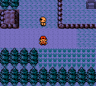
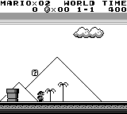
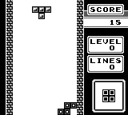

# PyBoy

Game Boy emulator written in Python


__If you have any questions, or just want to chat, [join us on Discord](https://discord.gg/Zrf2nyH).__

It is highly recommended to read the [report](https://github.com/Baekalfen/PyBoy/raw/master/PyBoy.pdf)
to get a light introduction to Game Boy emulation. _But do be aware, that the
Python implementation has changed a lot_. The report is relevant, even though
you want to contribute to another emulator, or create your own.

If you've read the report and want more explicit details, have a look at the
[Pan Docs](http://bgb.bircd.org/pandocs.htm).

__If you are looking to make a bot or AI__, you can find all the external
components in the [PyBoy Documentation](https://baekalfen.github.io/PyBoy/index.html).
There is also a short example on our Wiki page
[Scripts, AI and Bots](https://github.com/Baekalfen/PyBoy/wiki/Scripts,-AI-and-Bots)
as well as in the [examples directory](https://github.com/Baekalfen/PyBoy/tree/master/examples).
If more features are needed, or if you find a bug, don't hesitate to make an
issue here on GitHub, or write on our [Discord channel](https://discord.gg/Zrf2nyH).



__If you are looking to make a bot or AI__, you can find all the external
components in the [PyBoy
Documentation](https://baekalfen.github.io/PyBoy/index.html).

There is also a short example on our Wiki page
[Scripts, AI and
Bots](https://github.com/Baekalfen/PyBoy/wiki/Scripts,-AI-and-Bots)
as well as in the [examples
directory](https://github.com/Baekalfen/PyBoy/tree/master/examples).

If more features are needed, or if you find a bug, don't hesitate to make an
issue here on GitHub, or post on our [Discord channel](https://discord.gg/Zrf2nyH).

| Rewind any game | [Beat world records](https://github.com/uiucanh/tetris) | [Train with Reinforcement Learning](https://github.com/lixado/PyBoy-RL) |
| --- | --- | ---
|  |  |  |

## Installation

The instructions are simple, if you already have a functioning Python
environment on your machine.

1.  Install PyBoy using `pip install pyboy` (add `--user` if your system asks)
2.  If your system isn't supported by
    [pysdl2-dll](https://pypi.org/project/pysdl2-dll/), you'll need to install
    SDL2 from your package manager.

If you need more details, or if you need to compile from source, check out the
detailed [installation instructions](https://github.com/Baekalfen/PyBoy/wiki/Installation).
We support: macOS, Raspberry Pi (Raspbian), Linux (Ubuntu), and Windows 10.

Now you're ready! Either use PyBoy directly from the terminal with
`$ pyboy file.rom` or use it in your Python scripts:

```python
from pyboy import PyBoy
pyboy = PyBoy('ROMs/gamerom.gb')
while not pyboy.tick():
    pass
pyboy.stop()
```

Or using the context manager:

```python
from pyboy import PyBoy
with PyBoy('ROMs/gamerom.gb') as pyboy:
    while not pyboy.tick():
        pass
```

When the emulator is running, you can easily access
[PyBoy's API](https://baekalfen.github.io/PyBoy/index.html):

```python
from pyboy import WindowEvent

pyboy.send_input(WindowEvent.PRESS_ARROW_DOWN)
pyboy.tick() # Process one frame to let the game register the input
pyboy.send_input(WindowEvent.RELEASE_ARROW_DOWN)

pil_image = pyboy.screen_image()
pil_image.save('screenshot.png')
```

At the Wiki page, you will also find out how to interface with PyBoy from your
own project: [Wiki](https://github.com/Baekalfen/PyBoy/wiki).

## Contributors

Thanks to all the people who have contributed to the project!

### Original Developers

-   Asger Anders Lund Hansen - [AsgerLundHansen](https://github.com/AsgerLundHansen)
-   Mads Ynddal - [baekalfen](https://github.com/Baekalfen)
-   Troels Ynddal - [troelsy](https://github.com/troelsy)

### GitHub Collaborators

-   Kristian Sims - [krs013](https://github.com/krs013)

### Student Projects

-   __Rewind Time:__ Jacob Olsen - [JacobO1](https://github.com/JacobO1)
-   __Link Cable:__ Jonas Flach-Jensen - [thejomas](https://github.com/thejomas)
-   __Game Boy Color:__ Christian Marslev and Jonas Grønborg -
    [CKuke](https://github.com/CKuke) and [kaff3](https://github.com/kaff3)

## Contributing

Any contribution is appreciated. The currently known errors are registered in
the Issues tab. Feel free to take a swing at any one of them.

For the more major features, there are the following that you can give a try.
They are also described in more detail in the
[project list](https://github.com/Baekalfen/PyBoy/raw/master/Projects/Projects.pdf):

-   Color
-   Link Cable
-   _(Experimental)_ AI - use the `botsupport` or game wrappers to train a
    neural network
-   _(Experimental)_ Game Wrappers - make wrappers for popular games

If you want to implement something which is not on the list, feel free to do so
anyway. If you want to merge it into our repo, then just send a pull request
and we will have a look at it.

### Checklist for pull-requests

1.  The project is licensed under LGPL (see LICENSE.md). When merged, your code
    will be under the same license. So make sure you have read and understand
    it.
2.  Please coordinate with one of the core developers before making a big
    pull-request. It's a shame to make something big that doesn't fit the
    project.
3.  Remember to make a separate branch on your fork. This makes it a lot easier
    for the core developers to help getting your pull-request ready.
4.  Install `pip install pre-commit`. This takes care of the formatting rules
    when you commit your code.
5.  Add tests. We need good pytests for your code. This will help us keep the
    project stable.
6.  Please don't change the code style, unless it's specifically asked for.

## TODO

-   Document the use of `PYTEST_SECRETS_KEY`
